<div align="center">

# Ontologist

**Your AI-powered companion for mastering Palantir Foundry**

238 flashcards &bull; 310 quiz questions &bull; 12 hands-on labs &bull; 51 platform mappings &bull; 3 interview modes

[Getting Started](#getting-started) &bull; [Features](#features) &bull; [Screenshots](#screenshots) &bull; [Architecture](#architecture) &bull; [API Reference](#api-reference)

</div>

---

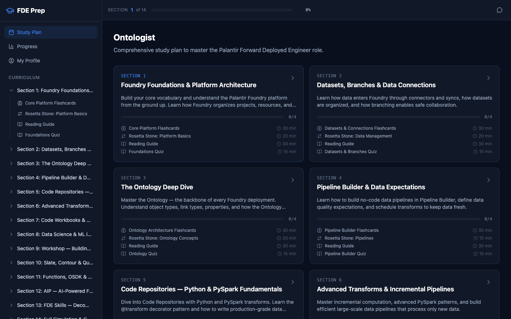

## What is Ontologist?

Ontologist is a full-stack study platform for professionals preparing to work with Palantir Foundry. It provides a structured 14-section curriculum that takes you from platform foundations through Python/PySpark, data science, application building, AIP integration, and FDE soft skills — with AI-powered tutoring at every step.

The app personalizes the entire experience to your background. Upload your resume, tell it what platforms you know, and every AI interaction — from the tutor to mock interviews to lab reviews — adapts to speak your language.

<div align="center">

| | |
|:---:|:---:|
| 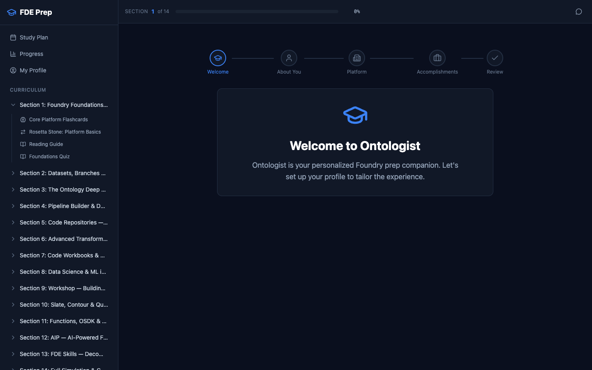 | 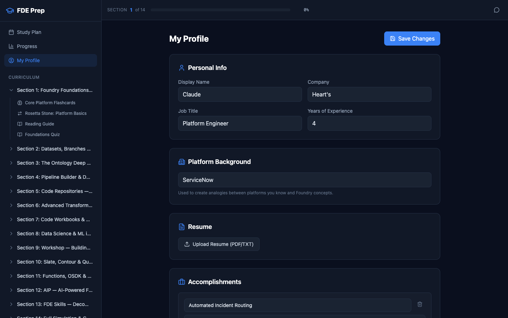 |
| *Personalized onboarding wizard* | *Ongoing profile management* |

</div>

## Getting Started

```bash
# Clone and install
git clone <repo-url> && cd ontologist
npm install && cd client && npm install && cd ..

# Configure
cp .env.example .env
# Add your Anthropic API key to .env

# Launch
npm run dev
```

Open **http://localhost:5173** — you'll be greeted by the onboarding wizard on first run.

## Features

### 14-Section Study Curriculum

A structured path from zero to Foundry-proficient, organized into focused sections with flashcards, quizzes, labs, and reference materials.

<div align="center">

| | |
|:---:|:---:|
| 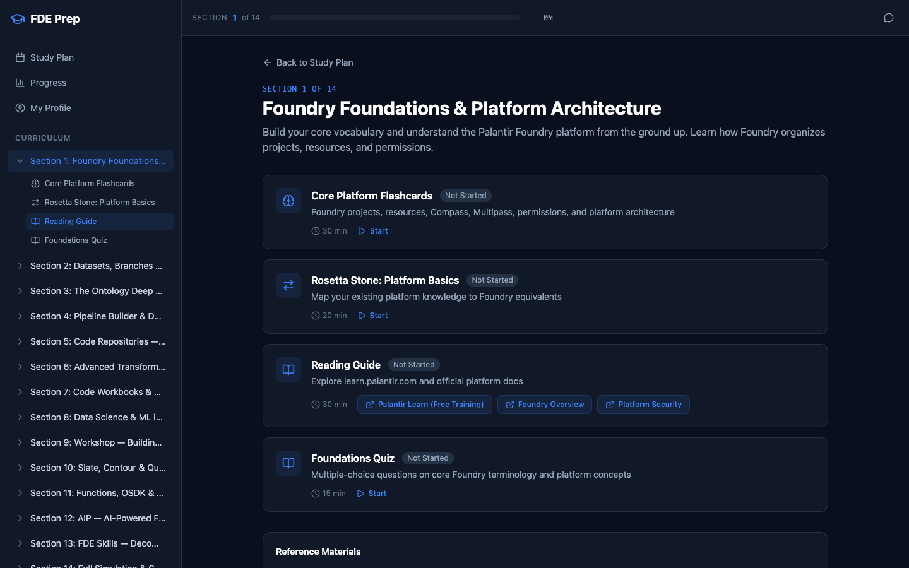 | 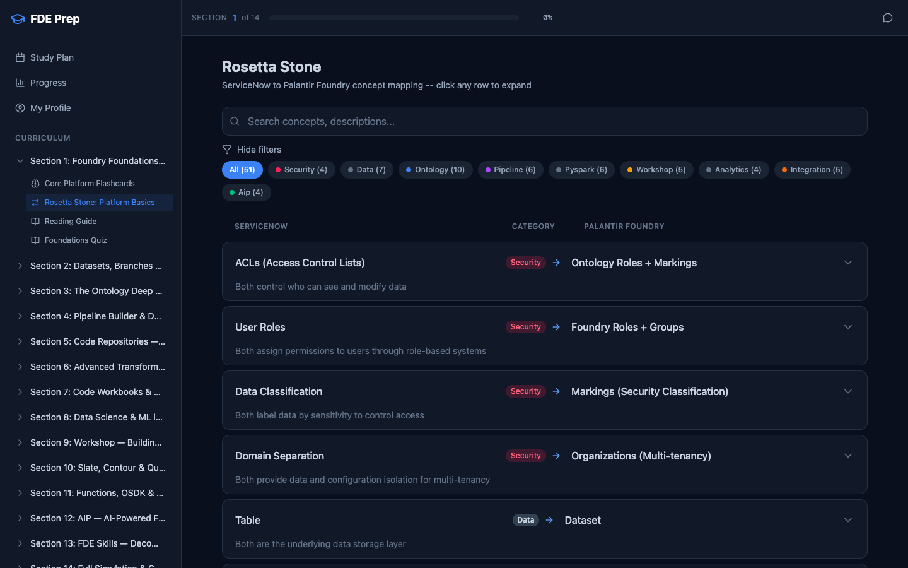 |
| *Section detail with activities and resources* | *Rosetta Stone: map what you know to Foundry* |

</div>

| Section | Topic | Highlights |
|:---:|---|---|
| 1 | **Foundry Foundations & Platform Architecture** | Security model, navigation, tech stack |
| 2 | **Datasets, Branches & Data Connections** | Connectors, branching, agents, Media Sets |
| 3 | **The Ontology Deep Dive** | Object Types, Links, Actions, Functions, OMS/OSS |
| 4 | **Pipeline Builder & Data Expectations** | Visual pipelines, scheduling, monitoring |
| 5 | **Code Repositories — Python & PySpark** | @transform, DataFrame ops, joins, window functions |
| 6 | **Advanced Transforms & Incremental Pipelines** | @incremental, performance, schema evolution |
| 7 | **Code Workbooks & pandas in Foundry** | @pandas_transform, SQL/R cells, visualization |
| 8 | **Data Science & ML in Foundry** | scikit-learn, PyTorch, model deployment, ML Objectives |
| 9 | **Workshop — Operational Applications** | Widgets, Variables, Events, Modules, Actions |
| 10 | **Slate, Contour & Quiver** | Custom apps, dashboards, exploration tools |
| 11 | **Functions, OSDK & External Integration** | TypeScript Functions, REST API, webhooks |
| 12 | **AIP — AI-Powered Foundry** | AIP Logic, AIP Assist, LLM integration, RAG |
| 13 | **FDE Skills — Decomposition & Communication** | Stakeholder discovery, engagement management |
| 14 | **Full Simulation & Comprehensive Assessment** | End-to-end engagement sim, 50-question final |

### Flashcard Engine

Spaced repetition using Leitner boxes (1-5). Cards advance on correct answers, retreat on incorrect. Each card includes a platform analogy to bridge your existing knowledge.

**238 cards** across 13 categories: platform, data, ontology, pipeline, pyspark, transforms, workbooks, ml, workshop, analytics, integration, aip, fde-skills.

<div align="center">

| | |
|:---:|:---:|
| 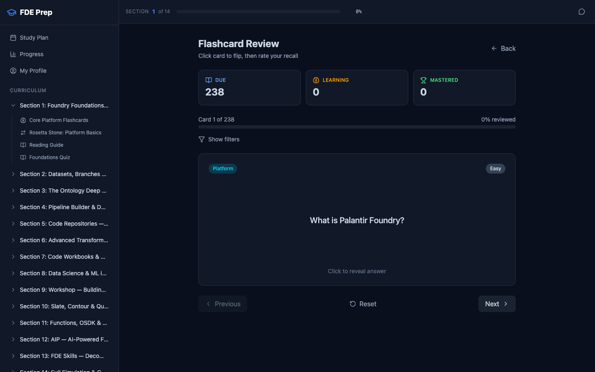 | 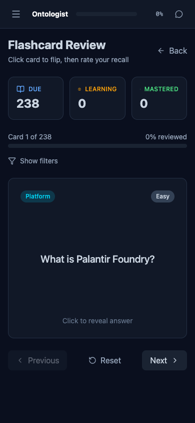 |
| *Desktop flashcard review* | *Fully responsive on mobile* |

</div>

### Quiz Engine

Timed multiple-choice with immediate feedback and explanations. Technical sections include PySpark, pandas, TypeScript, and OSDK code snippets.

**310 questions** — 20 per section plus a 50-question comprehensive final assessment.

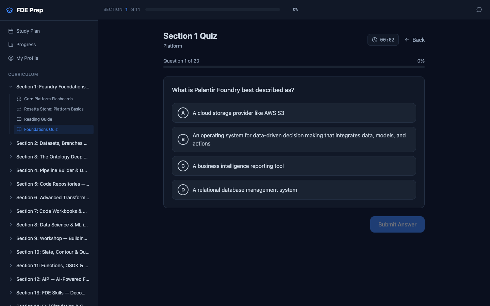

### Rosetta Stone

Interactive two-column comparison mapping **51 concepts** from platforms you already know to their Foundry equivalents. Organized across 9 categories with expandable detail rows.

### Guided Labs

**12 multi-step labs** (60 steps total) with progressive hints and AI-powered work review. Labs build on a continuous scenario thread personalized to your company context.

<div align="center">

| | |
|:---:|:---:|
| 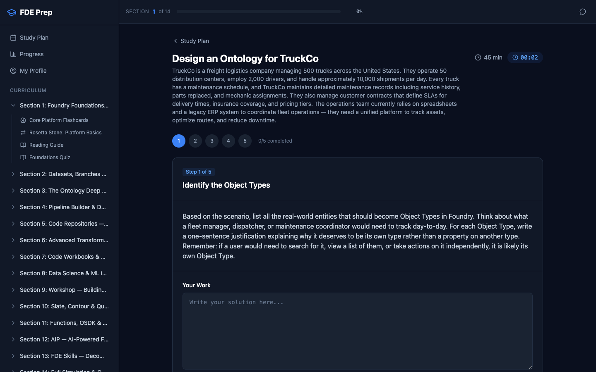 | 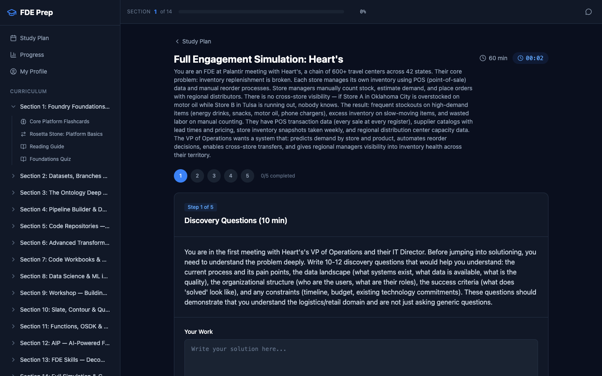 |
| *Step-by-step guided walkthrough* | *Full engagement simulation with your company* |

</div>

### Mock Interview Simulator

AI-powered practice across three Palantir interview formats. Includes timer, transcript saving, and AI-generated scorecards.

| Mode | Duration | Focus |
|:---:|:---:|---|
| Decomposition | 45 min | Breaking down complex, ambiguous business problems |
| Behavioral | 30 min | STAR-format questions with Palantir cultural emphasis |
| Technical | 30 min | Data modeling, system design, practical problem-solving |

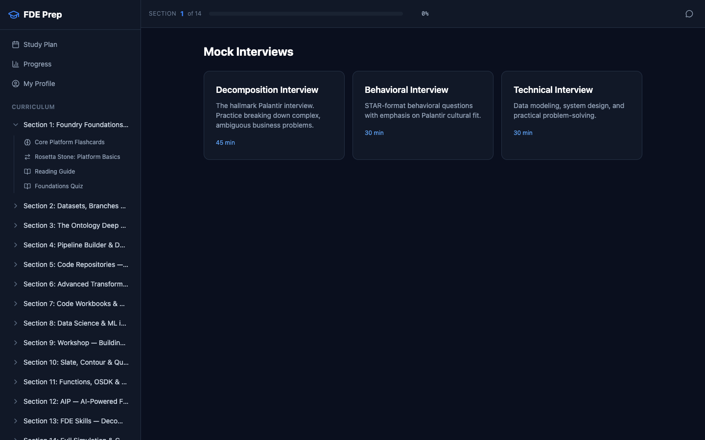

### Translate Your Experience

Dynamically generates exercises from your profile accomplishments. Practice reframing your real experience in Foundry terminology, with AI feedback on each translation.

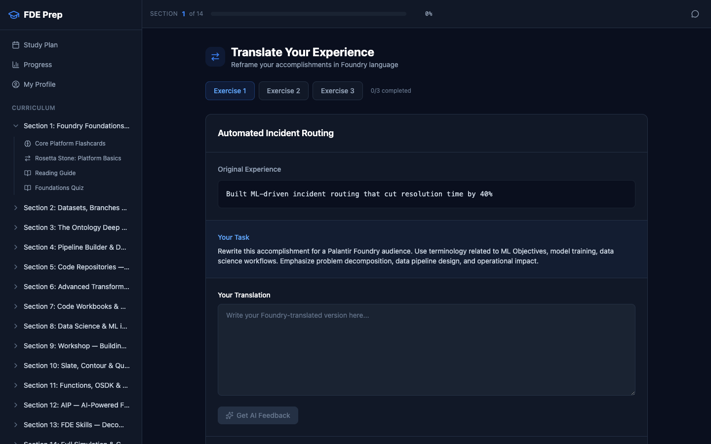

### Progress Dashboard

Track overall completion, section-by-section breakdown, flashcard mastery distribution, quiz scores, and time spent.

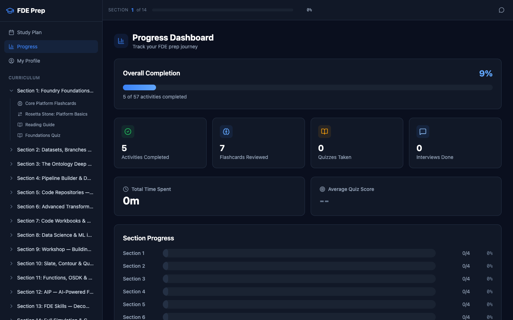

### AI Tutor Sidebar

A collapsible chat panel on every page. Supports multiple AI modes (Tutor, Interviewer, Lab Reviewer, Feedback) and renders full markdown responses. Every prompt is personalized to your background.

### Mobile Responsive

The entire app works on mobile devices with an adaptive layout — collapsible sidebar, touch-friendly cards, and responsive grids.

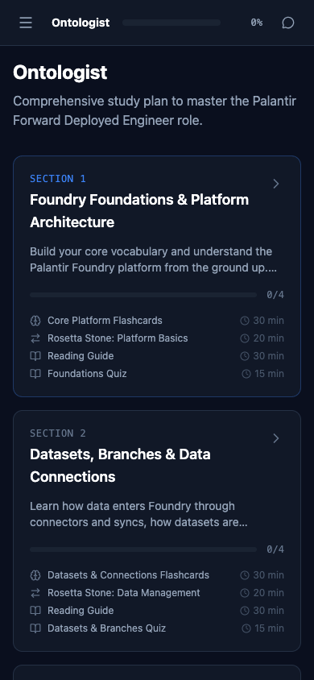

## Architecture

### Tech Stack

| Layer | Technology |
|:---:|---|
| Frontend | React 19 + Vite 7 + Tailwind CSS v4 |
| Backend | Node.js + Express 5 |
| Database | SQLite (better-sqlite3) |
| AI | Anthropic Claude API (claude-sonnet-4-6) |
| Icons | lucide-react |
| Routing | react-router-dom v7 |

### Project Structure

```
ontologist/
├── client/                          # React frontend (Vite)
│   └── src/
│       ├── components/
│       │   ├── Layout/              # Sidebar, TopBar, AIChatPanel
│       │   ├── StudyPlan/           # Dashboard + SectionDetail
│       │   ├── Flashcards/          # Spaced repetition engine
│       │   ├── Quiz/                # Timed quiz with scoring
│       │   ├── RosettaStone/        # Platform comparison viewer
│       │   ├── Labs/                # Multi-step guided walkthroughs
│       │   ├── MockInterview/       # AI interview simulator
│       │   ├── TranslateExperience/ # Experience reframing exercises
│       │   ├── Onboarding/          # 5-step profile setup wizard
│       │   ├── Profile/             # Profile management page
│       │   ├── Guards/              # Route guard (RequireProfile)
│       │   └── Progress/            # Analytics dashboard
│       ├── data/                    # Static content (cards, quizzes, labs, mappings)
│       ├── hooks/                   # useAI, useProgress, useTimer
│       └── context/                 # AppContext (global state)
├── server/
│   ├── routes/
│   │   ├── ai.js                    # Claude API proxy + SSE streaming
│   │   ├── progress.js              # Progress tracking CRUD
│   │   └── profile.js               # Profile CRUD + resume parsing
│   ├── utils/
│   │   └── promptTemplate.js        # Dynamic prompt injection from profile
│   ├── db/
│   │   ├── schema.sql               # SQLite schema
│   │   └── seed.js                  # DB initialization
│   └── prompts/                     # 8 AI system prompt templates
└── data/                            # SQLite database (auto-created)
```

### Database Schema

Four tables in SQLite (`data/progress.db`), auto-created on first run:

| Table | Purpose |
|---|---|
| **user_profile** | Name, company, background, accomplishments, resume text |
| **progress** | Activity completion tracking per section |
| **flashcard_progress** | Leitner box state per card (box 1-5, review counts) |
| **quiz_results** | Quiz answers and scores per attempt |
| **interview_transcripts** | Full chat transcripts with AI feedback |

## API Reference

### AI

| Method | Path | Description |
|---|---|---|
| `POST` | `/api/ai/chat` | Send messages to Claude (non-streaming) |
| `POST` | `/api/ai/chat/stream` | Send messages to Claude (SSE streaming) |

Request: `{ messages: [{role, content}], mode: string }`

Modes: `tutor` `interviewer-decomp` `interviewer-behavioral` `interviewer-technical` `feedback` `lab-reviewer` `decomposition` `resume-refiner`

### Profile

| Method | Path | Description |
|---|---|---|
| `GET` | `/api/profile` | Get user profile |
| `PUT` | `/api/profile` | Create or update profile |
| `POST` | `/api/profile/resume` | Upload and extract resume text (PDF/TXT) |
| `POST` | `/api/profile/resume/parse` | AI-parse resume into structured fields |
| `GET` | `/api/profile/exists` | Lightweight existence check |

### Progress

| Method | Path | Description |
|---|---|---|
| `GET` | `/api/progress` | All progress entries |
| `GET` | `/api/progress/section/:section` | Progress for a section |
| `POST` | `/api/progress` | Create/update progress entry |
| `GET` | `/api/progress/flashcards` | All flashcard review state |
| `POST` | `/api/progress/flashcards` | Record a flashcard review |
| `GET` | `/api/progress/quizzes` | All quiz results |
| `POST` | `/api/progress/quizzes` | Save a quiz result |
| `GET` | `/api/progress/interviews` | All interview transcripts |
| `POST` | `/api/progress/interviews` | Save an interview transcript |
| `GET` | `/api/progress/stats` | Aggregate statistics |

## NPM Scripts

| Command | Description |
|---|---|
| `npm run dev` | Start frontend + backend concurrently |
| `npm run dev:server` | Backend only (nodemon) |
| `npm run dev:client` | Vite dev server only |
| `npm run build` | Production build |
| `npm start` | Production server |
| `npm run seed` | Initialize database |
| `npm run reset` | Delete and re-initialize database |

## Environment Variables

| Variable | Description | Default |
|---|---|---|
| `ANTHROPIC_API_KEY` | Anthropic API key | *(required for AI features)* |
| `PORT` | Backend server port | `3001` |
| `DATABASE_PATH` | SQLite database path | `./data/progress.db` |

## Offline Capability

All content — flashcards, quizzes, Rosetta Stone mappings, labs, and the study plan — is bundled into the frontend. The app works fully offline for everything except AI-powered features (tutor, interviews, lab review, resume parsing).

## Design System

- **Theme**: Dark mode with navy/slate backgrounds, electric blue accents
- **Typography**: Inter (body) + JetBrains Mono (code)
- **Components**: Rounded-xl cards, navy-600 borders, 200ms transitions
- **Colors**: Defined via Tailwind v4 `@theme` in `client/src/index.css`

---

<div align="center">

Built with React, Express, SQLite, and Claude

</div>
